# ⚡ Secure Phase Control with STM32 (v2)

This project demonstrates the simulation and control of **Phase Angle Triggering** for power electronics applications (such as SCR/Thyristor control) using an STM32 microcontroller. It bridges the gap between theoretical MATLAB/Simulink models and real-world embedded implementation.

## 📋 Project Overview
The system reads an analog value from a potentiometer to determine the triggering angle (α) relative to a 50Hz virtual grid signal. The development of this project was systematically divided into four progressive stages: from theoretical modeling to hardware stabilization and digital signal verification.

---

## 🛠 Bill of Materials (BOM)
* **STM32F103RBT6 (Nucleo-64):** Main processor running at 64MHz HCLK.
* **7-Segment Display (Common Cathode):** Visual status and power level indicator.
* **50k Potentiometer:** Manual control of the triggering angle.
* **10µF 16V Electrolytic Capacitor:** Filtering ADC input noise.
* **Blue LED:** Visualizing the high-frequency trigger pulse.
* **Resistors:** 120Ω (for display segments) and 680Ω (for the pulse LED).
* **Logic Analyzer:** Digital verification of signal timing and phase shift.

---

## 🏗 Circuit Diagram

```mermaid
graph TD

MCU[STM32 Nucleo]

A[Segment A]
B[Segment B]
C[Segment C]
D[Segment D]
E[Segment E]
F[Segment F]
G[Segment G]

MCU -- PA10 D2 +120Ω --> A
MCU -- PB3 D3 +120Ω --> B
MCU -- PB5 D4 +120Ω --> C
MCU -- PB4 D5 +120Ω --> D
MCU -- PB10 D6 +120Ω --> E
MCU -- PA8 D7 +120Ω --> F
MCU -- PA9 D8 +120Ω --> G

SEG_GND[7 Segment GND Pins 1,10]
SEG_GND --> GND[GND]

POT[50k Potentiometer]
V33[3.3V]

V33 --> POT
POT -- Wiper --> PA0[A0 / PA0]
PA0 --> MCU
POT --> GND

CAP[10uF Capacitor]
CAP -- + --> PA0
CAP -- - --> GND

LED[Blue LED]
MCU -- PC7 D9 +680Ω --> LED
LED --> GND

LA[Logic Analyzer]

MCU -- PB6 D10 Grid Signal --> LA
MCU -- PC7 D9 Trigger --> LA
GND --> LA

BTN[B1 Button]
BTN -- PC13 --> MCU
```

---

## 🔍 Hardware Verification: 7-Segment Pinout Analysis
When working with unknown 7-segment displays, the "Engineering Detective" method is used for verification:
1. Connect a GND wire from the Nucleo to one of the center pins (Pin 1 or 10).
2. Use a 3.3V wire as a probe to touch other pins.
3. Observe which segment lights up for each pin to create a hardware map.

| Display Pin | Function | Segment Label |
| :--- | :--- | :--- |
| **1 & 10** | **Common Cathode** | **GND** |
| 6 | Top Horizontal | A |
| 7 | Upper Right Vertical | B |
| 9 | Lower Right Vertical | C |
| 5 | Bottom Horizontal | D |
| 4 | Lower Left Vertical | E |
| 3 | Upper Left Vertical | F |
| 8 | Center Horizontal | G |

---

## 🚀 Development Stages

### Stage 1: Theoretical Modeling (Simulink)
Before writing any embedded code, the phase control logic was modeled and verified in MATLAB/Simulink. This ensured the mathematical accuracy of the phase-shift algorithm and provided a reference waveform for later hardware testing.

> 
> *Theory: Expected output waveform relative to the control signal.*

### Stage 2: Basic Phase Control (Potentiometer & Display)
The potentiometer's analog value (0-4095) is mapped to a delay of 0-10ms (the duration of a half-cycle at 50Hz). As the pot is turned, the 7-segment display updates from 0 to 9 to show the current power level in real-time.

> 
> *Stage 2: Potentiometer at mid-range (50% power level).*

### Stage 3: Safety Lock & Hardware Stabilization
To meet industrial safety standards, an interrupt-based "Safety Lock" mechanism was implemented using the Nucleo's User Button (B1). When locked, the display shows **'L'**, and all output signals are suppressed. Additionally, a 10µF capacitor was added to the ADC input to prevent signal jitter, and a Blue LED was added for physical pulse visualization.

> 
> *Stage 3: System in 'Locked' state (outputs disabled).*

### Stage 4: Digital Signal Verification
The final stage involves using a Logic Analyzer to digitally verify the timing. The captures demonstrate the precise shift of the `PULSE_OUT` signal (1ms width) relative to the 50Hz `GRID_SIG`, proving the success of the embedded phase control algorithm.

> 
> *Stage 4: The 1ms trigger pulse shifting across the 10ms positive alternans.*

---

## ⚙️ How to Run
1. Open the `02_Secure_Phase_Control_v2` project in **STM32CubeIDE**.
2. Ensure the clock is configured to 64MHz HCLK.
3. Flash the code to your Nucleo board.
4. Connect your logic analyzer to pins **D9** and **D10** to observe the phase control in real-time.
